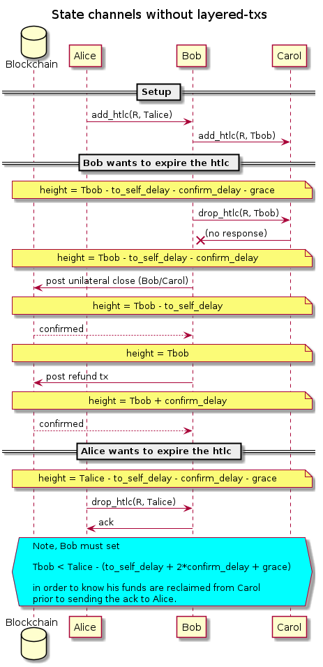

# Layered transactions

When dealing with payment channels we have two timeouts to consider:

 * The payment timeout, after which the sender of the payment can
   require a refund if the payment hasn't completed.

 * The revocation timeout, after which the channel state can be considered
   final, and not subject to being updated (eg in eltoo channels) or
   subject to a penalty (eg in current Poon-Dryja channels). This is called
   the `to_self_delay` in lightning.

The interaction between these two timeouts can cause problems.

## Without layered commitments

The worst case scenario for obtaining a refund occurs when you're
forwarding a payment, and the node to which you've forwarded the payment
has gone completely offline, forcing you to drop the channel to the
blockchain.

In this case, without layered commitments, in order to claim the funds
on-chain as quickly as possible (namely at the payment timeout plus some
delay for confirmations), you need to work backwards to ensure you've
published the current state early enough that the revocation timeout
as also completed by then (even if it also was delayed because your
transaction didn't immediately confirm).

If you're Bob, and have forwarded a payment from Alice to Carol, this
looks something like the following:

